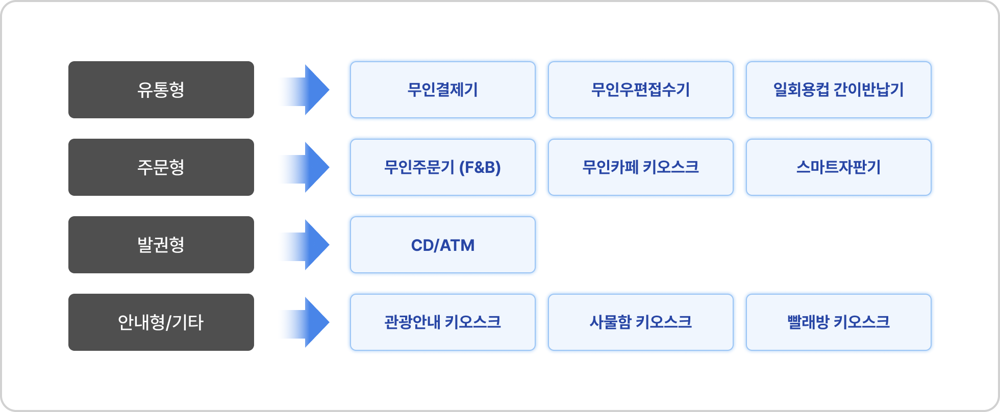
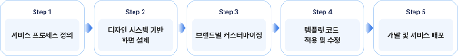

# 배리어프리 키오스크 탬플릿 코드
키오스크는 서비스 환경에 따라 화면 구조와 사용 방식이 달라 사용자 경험의 차이가 발생한다.
 이를 해결하기 위해 무인정보단말기 접근성 지침을 반영한 디자인 시스템을 구축하고,
 다양한 환경에서도 일관된 접근성과 사용성을 제공할 수 있도록 템플릿 코드를 제공한다.

* [Figma 라이브러리: Barrier-Free Kiosk Design System v1.0.0](https://www.google.com)

  

# 목표
배리어프리 키오스크 디자인 시스템을 기반으로, 
다양한 서비스 환경에 적용 가능한 UI 템플릿 코드와 개발 가이드를 제공한다.

본 저장소는 HTML/CSS/JS 구조와 컴포넌트 기준을 반영하여
일관된 사용자 경험, 접근성, 유지보수성을 고려한 키오스크 UI 구현을 지원한다.

본 템플릿은 다음을 목표로 합니다:
- 표준화된 UI 구조 제공
- 접근성 기준 준수
- 빠른 화면 개발 및 확장
- 유지보수 가능한 코드 구조

  

# 구성
무인으로 많이 운영되는 매장 업종을 기준으로 대표적인 서비스 유형을 도출하고,
이를 반영한 10종의 템플릿을 제작하였다.

  

  

# 디자인 시스템 활용 과정
배리어프리 키오스크 디자인 시스템은 다양한 업종과 브랜드 환경에 맞는 키오스크 서비스를
효율적으로 설계 및 개발 할 수 있도록 지원한다.

  

  

# 저작권 & 라이센스
배리어프리 키오스크 디자인 시스템은 공공누리 제1유형(출처표시)에 따라 자유롭게 이용할 수 있다.
 

  

 
출처를 명확히 표시하는 경우, 상업적 이용 및 수정·재배포가 가능하며,
 2차적 저작물 제작 및 배포 또한 허용된다.

이용 시 아래와 같이 출처를 표기해주시기 바랍니다.

출처 표기 예시.
본 저작물은 한국지능정보사회진흥원에서 제작한 ‘배리어프리 키오스크 디자인 시스템’을 활용했습니다.
가능한 경우, 관련 웹사이트 또는 저장소 링크를 함께 표기해주시기 바랍니다.

© 2026 한국지능정보사회진흥원. All Rights Reserved. 

